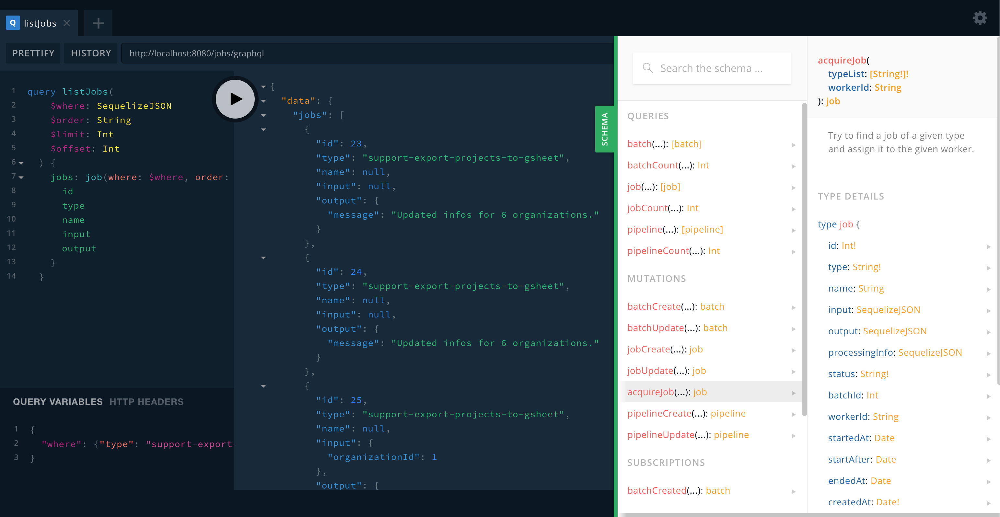

## Table of contents

1. Getting started
2. [What's a Job/Batch/Pipeline](02_Whats_a_Job_Batch_Pipeline.md)
3. [Running the server](03_Running_the_server.md)
4. [Creating a worker](04_Creating_a_worker.md)
5. [The GNJ API](05_The_GNJ_API.md)
6. [Plugin the server to your express](06_Plugin_the_server_to_your_express.md)
7. [Q&A](07_QA.md)
8. [Contributing](08_Contributing.md)

---

A job scheduler, a runner and an interface to manage jobs. In one lib.

---

## Why graphql-node-jobs?

Use GNJ is you want a project that:

- Is simple yet powerful: The models, the API, the code... are kept simple
- Job persistance: Everything is stored in a database
- No-SaaS: Want to keep your data in your servers? Perfect, GNJ is just Javascript running on your stack
- Simple: Just a few thousands lines of code (but tested ones 😄)
- Not a black box: Can be integrated easily in your Node.js codebase
- Use your ORM: GNJ uses Sequelize, so you stay in known territories
- Database Agnostic: Any database handled by Sequelize can be used

Other projects that might be interesting for you:

- https://github.com/graphile/worker

GNJ is kept small on purpose, the goal is to have the smallest API for the biggest impact.

---

## What does it do?

It allows you to setup many execution pipelines and run them.


_The default GraphQL-workbench interface._

---

## How it works

NGJ (graphql-node-jobs) is available as:

- A standalone NodeJS application
- A GraphQL schema plugable to your Apollo server Schema

---

## How can I integrate NGJ to my app?

---

### Prerequisites

To use GNJ, you need a project with:

- Apollo Server V4
- Express
- Sequelize
- [GraphQL-Sequelize-Generator](https://github.com/teamstarter/graphql-sequelize-generator)

A few modules need to be installed, like Graphql-tag, react, WebSocket, etc.

---

### Adding GraphQL-Node-Jobs to your project

```
yarn add graphql-node-jobs
```

To use the api, there is [node-graphql-jobs-react](https://github.com/vincentdesmares/node-jobs-react) that provide convenient Components to list/trigger/delete and other useful actions. It uses Websockets by default to provide a near-realtime experience.

---

[Next: What's a Job/Batch/Pipeline](02_Whats_a_Job_Batch_Pipeline.md)

---

### Teamstarter's other libraries

- [GraphQL-Sequelize-Generator](https://teamstarter.github.io/GSG-documentation/)
  - A Graphql API generator based on Sequelize.
- [GraphQL-Web-Hooks](https://teamstarter.github.io/GWH-documentation/)
  - A webhook implementation for GraphQL
